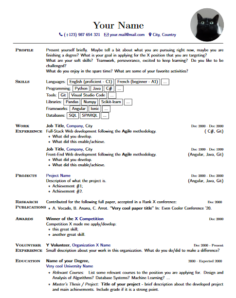

## simple-cv

Simple resume example to be filled/altered as wished.

* To change fonts find "\fontfamily" and replace parameter.
* Don't forget to change values in "\href".
* Upload a small picture in order to not create a PDF with a large size.

- - - -

Unfilled Resume:
